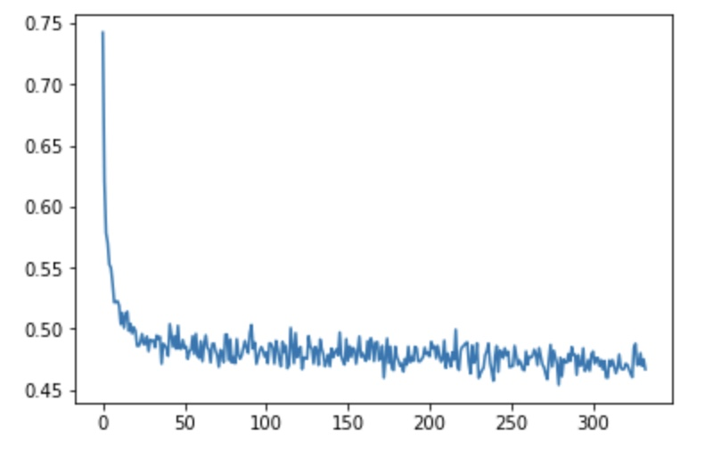
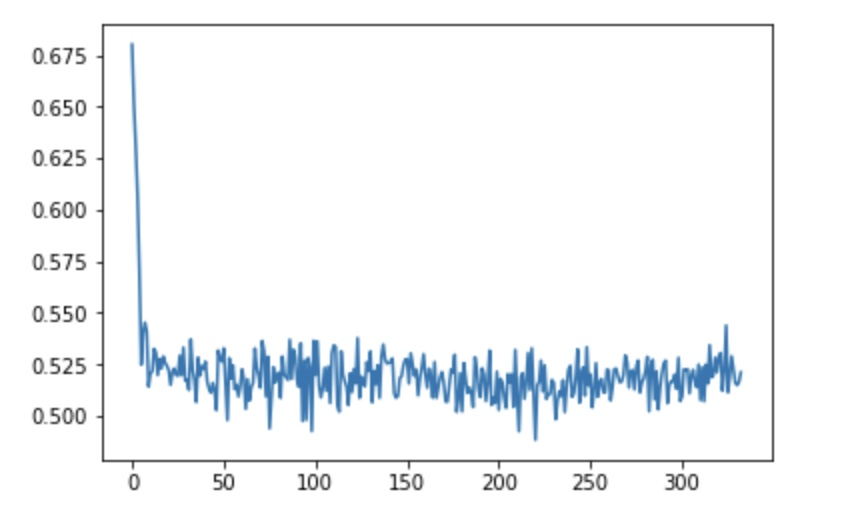

## RNN Cell Implication
RNN cell的基本实现。

### 训练集
输入数据X：在时间t，的值有50%的概率为1，50%的概率为0；  
输出数据Y：在时间t，的值有50%的概率为1，50%的概率为0，除此之外，还有两条规则：
* 规则1:如果 == 1，为1的概率增加50%
* 规则2:如果 == 1，则为1的概率减少25%， 如果上述两个条件同时满足，则为1的概率为75%。

### 预期loss
初始未训练时的loss在0.66左右，训练完成后在0.45左右

### 训练结果
设置每个cell中维数为4    

设置每个cell中维数为16   

